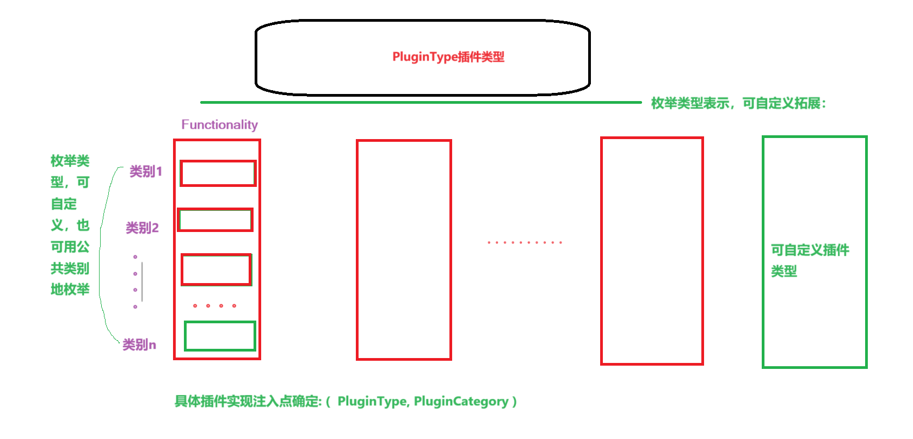
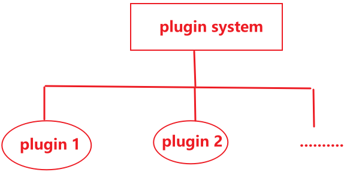

# 插件系统开发文档

## 插件归类介绍

### 1.**功能扩展类插件**

- **描述**: 这些插件通过添加新的功能或特性来扩展应用程序的核心功能。

- 示例

  :

  - 浏览器插件（如广告拦截器、翻译工具）。
  - IDE插件（如代码格式化工具、调试工具）。
  - 文档编辑器插件（如拼写检查、模板管理）。

### 2. **集成类插件**

- **描述**: 这些插件允许应用程序与其他服务或工具集成，通常用于数据同步或外部服务调用。

- 示例

  :

  - API集成插件（如支付网关、社交媒体分享）。
  - 数据库连接插件（如支持不同类型的数据库）。
  - 第三方服务集成（如邮件发送、云存储）。

### 3. **UI/UX类插件**

- **描述**: 这些插件通常用于改善用户界面的外观和用户体验，可能包括视觉增强和交互功能。

- 示例

  :

  - 主题/皮肤插件（改变应用程序的外观）。
  - 自定义控件或小部件（如日历、图表）。
  - 动画效果插件。

### 4. **安全类插件**

- **描述**: 这些插件专注于增强应用程序的安全性，通常用于防止攻击或保护用户数据。

- 示例

  :

  - 防火墙插件。
  - 安全扫描插件（如防止SQL注入、XSS攻击）。
  - 身份验证/授权插件。

### 5. **分析与监控类插件**

- **描述**: 这些插件用于收集、分析和监控应用程序的性能和使用情况。

- 示例

  :

  - 性能监控插件（如内存使用、CPU消耗）。
  - 日志记录插件（如错误日志、访问日志）。
  - 分析工具集成（如Google Analytics插件）。

### 6. **内容管理类插件**

- **描述**: 这些插件用于管理应用程序中的内容，通常用于CMS（内容管理系统）中。

- 示例

  :

  - SEO插件（搜索引擎优化）。
  - 多语言支持插件。
  - 媒体管理插件（如图片库、视频播放器）。

### 7. **开发工具类插件**

- **描述**: 这些插件主要用于开发阶段，帮助开发人员更高效地编码、测试和调试。

- 示例

  :

  - 代码生成器插件。
  - 测试框架集成插件。
  - 持续集成插件。

### 8. **自动化类插件**

- **描述**: 这些插件用于自动化某些流程或任务，减少手动操作的需求。

- 示例

  :

  - 构建工具插件（如Gradle、Maven插件）。
  - 部署自动化插件。
  - 测试自动化插件。

### 9. **数据处理类插件**

- **描述**: 这些插件用于处理和转换数据，通常用于数据导入/导出、格式转换等。

- 示例

  :

  - 数据导入/导出插件（如CSV、JSON）。
  - 数据清理和转换插件。
  - 报告生成插件。

### 10. **通信类插件**

- **描述**: 这些插件支持应用程序与其他系统、服务或设备之间的通信。

- 示例

  :

  - WebSocket插件。
  - 消息队列插件（如RabbitMQ、Kafka）。
  - 实时通信插件（如视频会议、聊天）。

### 10.微应用miniAPP

类似小程序独立运行的小型应用

## 插件系统设计





### 插件管理类设计：PluginManager

#### 功能

- 注册插件:register
- 注销已注册的插件:unregister
- 获取已注册的插件:getPlugin
- 初始化所有已注册的插件: initialAll
- 释放所有已注册的插件：disposeAll

##### dart语言实现：

```dart
/*
插件管理器
 */
class PluginManager {
  /*
  注册插件
   */
  registerPlugin() {
    //
  }

  /*
  注销插件
   */
  unregisterPlugin() {
    //
  }

  /*
  获取已注册的插件
   */
  getPlugin() {
    //
  }

  /*
  初始还所有已注册的插件
   */
  initialAll() {
    //
  }

  /*
  释放所有已注册插件
   */
  disposeAll() {
    //
  }
}
```

### 插件类设计：Plugin

#### 属性

* 插件唯一性ID: id

- 插件名称: name
- 插件类型: type

#### 方法

- 初始化: initial
- 释放插件: dispose

#### dart语言实现

插件枚举类型

- PluginType.dart

```dart
enum PluginType {
  Functionality,
  Integration,
  UI,
  Security,
  Analytics,
  ContentManagement,
  DevelopmentTools,
  Automation,
  DataProcessing,
  Communication,
  miniApp
}
```

- Plugin.dart

```dart
/*
插件类:抽象类接口
 */
import 'PluginType.dart';

abstract class Plugin<T extends PluginType> {
    
  // 插件ID：唯一性标识
  String get id;

  // 插件名称
  String get name;

  // 插件类型: 采用枚举类型T
  T get type;

  // 启用状态
  bool get status;
    
    
  /*
  抽象实现接口1: 注册插件
   */
  registerPlugin() {
    //
  }

  /*
  抽象实现接口2:: 注销插件
   */
  dispose() {
    //
  }
}
```

### 插件存储设计

#### 应用运行过程插件存储设计

* app启动过程中从**本地化存储**中**获取**插件列表**
* 将本地化存储中取出的插件列表进行注册，同时单例实例化插件管理器为全局单例对象，在GlobalManager全局中进行初始化
* 然后即可调用插件注入点管理器进行管理和运行

#### 应用未运行过程插件存储设计

* 采用Hive能封装对象Object进行对象持久化存储在本地
* 对于Object对象设计
  1. 插件名称:  name
  2. 插件类型：pluginType
  3. 插件类别：pluginCategory
  4. 插件evc的加载路径：path
  5. 插件创建的日期: time
  6. 插件状态:status


### 插件注入点设计

#### 插件注入点抽象类

```dart
/*
插件注入点抽象类
 */

import 'package:socket_service/microService/pluginSystem/Plugin.dart';
import 'package:socket_service/microService/pluginSystem/PluginType.dart';
import 'PluginInsertPointType.dart';

abstract class PluginInsertPoint<T extends ConPluginType,
    Z extends PluginType> {
  // plugin插件类型: PluginType
  Z get type;

  // 串并联控制类型
  T get pluginConnType;

  // 已注册的插件: 用于使用插件
  List<Plugin> get pluginAll;
}

```


## 插件实现日志记录

### 1.**功能扩展类插件**


### 2. **集成类插件**


### 3. **UI/UX类插件**


### 4. **安全类插件**


### 5. **分析与监控类插件**


### 6. **内容管理类插件**


### 7. **开发工具类插件**


### 8. **自动化类插件**


### 9. **数据处理类插件**


### 10. **通信类插件**


### 11.微应用

